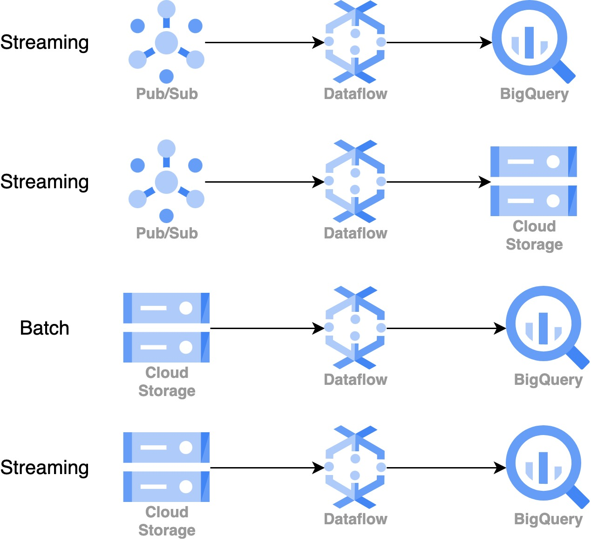

# Google Cloud Dataflow Pipeline Examples
This repository contains a collection of Apache Beam Dataflow pipelines, demonstrating various use cases for reading, processing, and writing data using Google Cloud Platform services, such as Pub/Sub, BigQuery, and Cloud Storage.

## Overview

1. **Pub/Sub to BigQuery (Streaming)**: A Dataflow pipeline that reads raw events from a Cloud Pub/Sub subscription and writes the processed data to a BigQuery table.
2. **Pub/Sub to Cloud Storage (Streaming)**: A Dataflow pipeline that reads raw events from a Cloud Pub/Sub topic, processes them, and writes the results to Cloud Storage in windows of a specified size.
3. **Cloud Storage to BigQuery (Batch)**: A Dataflow pipeline that reads files from Cloud Storage, processes them, and writes the results to a BigQuery table in batch mode.
4. **Cloud Storage to BigQuery (Streaming)**: A Dataflow pipeline that reads files from Cloud Storage and writes the processed data to a BigQuery table using streaming inserts.
<p align="center">
  
</p>

## Prerequisites

To run the pipelines, you need:

- A Google Cloud Platform project with the necessary APIs enabled
- A Google Cloud Storage bucket for storing templates and temporary files
- A Google Cloud Pub/Sub topic and subscription
- A Google BigQuery dataset and table

## Setup

1. Install the [Google Cloud SDK](https://cloud.google.com/sdk/docs/install)
2. Authenticate with Google Cloud: `gcloud auth login`
3. Set the default project: `gcloud config set project [PROJECT_ID]`
4. Update the necessary variables in the pipeline source code (e.g., project ID, bucket names, topic/subscription names, dataset, and table names)

## Running the Pipelines

To run a pipeline, first, ensure that your pipeline is uploaded as a template on Google Cloud Storage. Then, execute the template using the `gcloud` command.

The general format of the command is:

```
gcloud dataflow jobs run [JOB_NAME] \
    --gcs-location gs://[PATH_TO_TEMPLATE] \
    --parameters [PARAMETERS] \
    --region [REGION] \
    --project [PROJECT_ID]
```

Replace `[JOB_NAME]` with the name of your job, `[PATH_TO_TEMPLATE]` with the Google Cloud Storage path to your template, `[PARAMETERS]` with your pipeline parameters, `[REGION]` with your GCP region, and `[PROJECT_ID]` with your GCP project ID.

For example, to run the **Pub/Sub to BigQuery (Streaming)** pipeline:

```
gcloud dataflow jobs run pubsub-to-bigquery \
    --gcs-location gs://my-bucket/templates/pubsub-to-bigquery \
    --parameters inputSub=[SUBSCRIPTION_NAME],tableBaseName=[BIGQUERY_TABLE_NAME] \
    --region us-central1 \
    --project my-project
```

Use the same format for other pipelines, replacing the template path and parameters as needed.

## License

This repository is licensed under the MIT License. See the [LICENSE](https://opensource.org/license/mit/) file for details.